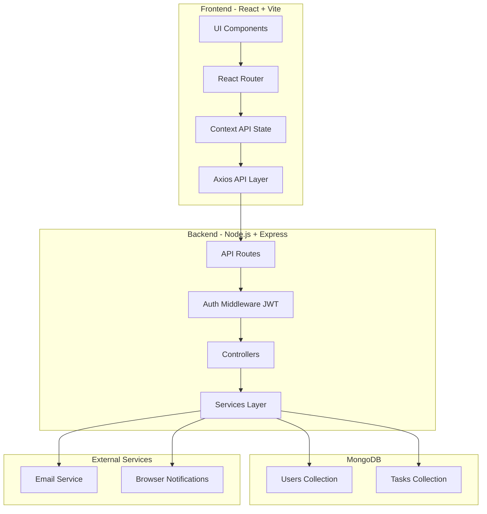
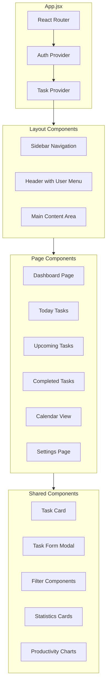
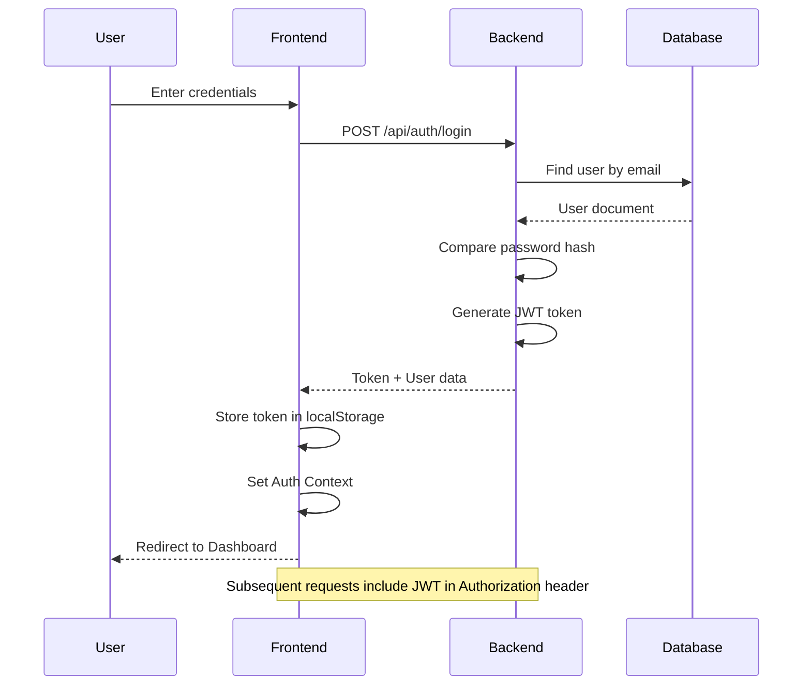
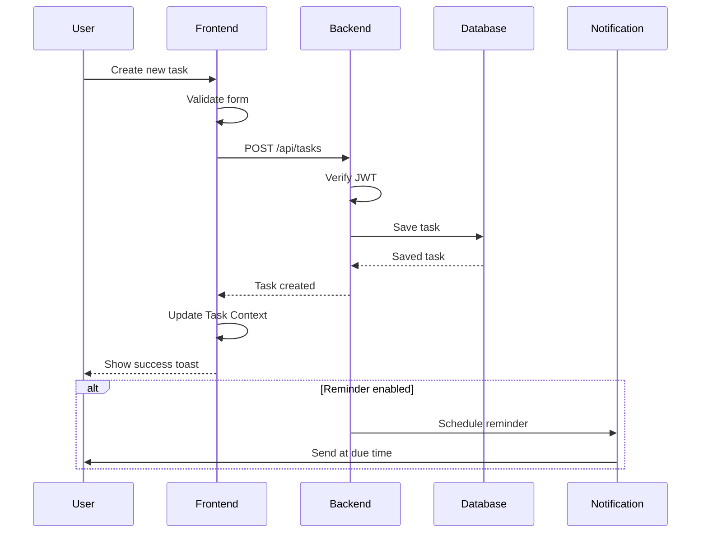
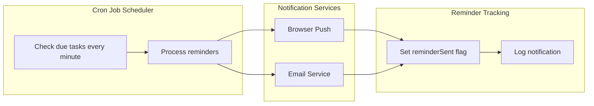
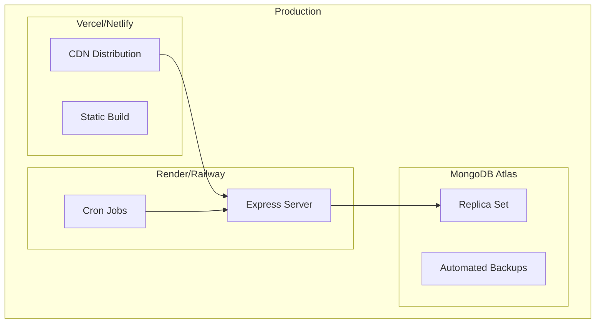

# Smart Task Scheduler & Reminder System - Architecture Plan

## Project Overview

A full-stack web application for managing daily tasks, setting reminders, and organizing productivity with a soft light green UI theme.

---

## System Architecture



---

## Technology Stack

### Frontend
| Technology | Purpose |
|------------|---------|
| React 18 + Vite | Core framework with fast build |
| Tailwind CSS | Styling with custom green theme |
| React Router v6 | Client-side routing |
| Context API | State management |
| Axios | HTTP client for API calls |
| Framer Motion | Animations |
| React Big Calendar | Calendar view |
| Chart.js / Recharts | Productivity charts |
| Lucide React | Icons |
| React Hot Toast | Toast notifications |
| React Beautiful DnD | Drag and drop |

### Backend
| Technology | Purpose |
|------------|---------|
| Node.js | Runtime environment |
| Express.js | Web framework |
| MongoDB + Mongoose | Database and ORM |
| JWT | Authentication tokens |
| bcrypt | Password hashing |
| Nodemailer | Email reminders |
| node-cron | Scheduled tasks |
| express-validator | Input validation |
| cors | Cross-origin support |
| dotenv | Environment variables |

---

## Design System

### Color Palette
```css
/* Primary Colors */
--primary-light: #A8E6CF;    /* Soft Light Green - Main theme */
--primary-dark: #6BCB77;     /* Darker Green - Accents, buttons */
--primary-hover: #5ABD69;    /* Hover state */

/* Background Colors */
--bg-main: #F5FBF7;          /* Very light green background */
--bg-card: #FFFFFF;          /* White cards */
--bg-sidebar: #E8F5E9;       /* Light green sidebar */

/* Text Colors */
--text-primary: #1B4332;     /* Dark green text */
--text-secondary: #40916C;   /* Medium green text */
--text-muted: #74C69D;       /* Light green text */

/* Priority Colors */
--priority-low: #A8E6CF;     /* Light green */
--priority-medium: #FFD93D;  /* Yellow */
--priority-high: #FF6B6B;    /* Red */

/* Status Colors */
--status-success: #6BCB77;   /* Green */
--status-warning: #FFD93D;   /* Yellow */
--status-error: #FF6B6B;     /* Red */
```

### Typography
- Primary Font: Inter or Poppins
- Headings: 600-700 weight
- Body: 400-500 weight
- Line height: 1.5-1.6

### Spacing System
```css
--space-xs: 0.25rem;   /* 4px */
--space-sm: 0.5rem;    /* 8px */
--space-md: 1rem;      /* 16px */
--space-lg: 1.5rem;    /* 24px */
--space-xl: 2rem;      /* 32px */
--space-2xl: 3rem;     /* 48px */
```

### Component Styling
- Border radius: 8px-12px for cards, 6px for buttons
- Box shadow: Soft shadows with green tint
- Transitions: 200-300ms ease-in-out
- Focus states: Green ring outline

---

## Database Schema

### User Schema
```javascript
{
  _id: ObjectId,
  name: {
    type: String,
    required: true,
    trim: true,
    maxlength: 50
  },
  email: {
    type: String,
    required: true,
    unique: true,
    lowercase: true,
    trim: true
  },
  password: {
    type: String,
    required: true,
    minlength: 6
  },
  avatar: String,
  settings: {
    notifications: {
      email: { type: Boolean, default: true },
      browser: { type: Boolean, default: true }
    },
    theme: { type: String, default: 'light' }
  },
  createdAt: { type: Date, default: Date.now },
  updatedAt: { type: Date, default: Date.now }
}
```

### Task Schema
```javascript
{
  _id: ObjectId,
  userId: {
    type: ObjectId,
    ref: 'User',
    required: true
  },
  title: {
    type: String,
    required: true,
    trim: true,
    maxlength: 100
  },
  description: {
    type: String,
    trim: true,
    maxlength: 500
  },
  dueDate: {
    type: Date,
    required: true
  },
  time: {
    type: String,
    default: '09:00'
  },
  priority: {
    type: String,
    enum: ['low', 'medium', 'high'],
    default: 'medium'
  },
  status: {
    type: String,
    enum: ['pending', 'completed'],
    default: 'pending'
  },
  category: {
    type: String,
    default: 'general'
  },
  reminderEnabled: {
    type: Boolean,
    default: true
  },
  reminderSent: {
    type: Boolean,
    default: false
  },
  order: {
    type: Number,
    default: 0
  },
  createdAt: { type: Date, default: Date.now },
  updatedAt: { type: Date, default: Date.now }
}
```

---

## API Endpoints

### Authentication Routes
| Method | Endpoint | Description | Auth |
|--------|----------|-------------|------|
| POST | /api/auth/register | Register new user | No |
| POST | /api/auth/login | Login user | No |
| POST | /api/auth/logout | Logout user | Yes |
| GET | /api/auth/me | Get current user | Yes |
| PUT | /api/auth/profile | Update profile | Yes |
| PUT | /api/auth/password | Change password | Yes |

### Task Routes
| Method | Endpoint | Description | Auth |
|--------|----------|-------------|------|
| GET | /api/tasks | Get all user tasks | Yes |
| GET | /api/tasks/today | Get today tasks | Yes |
| GET | /api/tasks/upcoming | Get upcoming tasks | Yes |
| GET | /api/tasks/completed | Get completed tasks | Yes |
| GET | /api/tasks/:id | Get single task | Yes |
| POST | /api/tasks | Create new task | Yes |
| PUT | /api/tasks/:id | Update task | Yes |
| DELETE | /api/tasks/:id | Delete task | Yes |
| PATCH | /api/tasks/:id/complete | Toggle complete | Yes |
| PUT | /api/tasks/reorder | Reorder tasks | Yes |
| GET | /api/tasks/stats | Get task statistics | Yes |

### Settings Routes
| Method | Endpoint | Description | Auth |
|--------|----------|-------------|------|
| GET | /api/settings | Get user settings | Yes |
| PUT | /api/settings | Update settings | Yes |

---

## Project Structure

```
task-scheduler/
|-- /server
|   |-- /config
|   |   |-- db.js                 # Database connection
|   |   |-- email.js              # Email configuration
|   |-- /controllers
|   |   |-- authController.js     # Auth logic
|   |   |-- taskController.js     # Task logic
|   |   |-- settingsController.js # Settings logic
|   |-- /middleware
|   |   |-- auth.js               # JWT verification
|   |   |-- validate.js           # Request validation
|   |   |-- errorHandler.js       # Error handling
|   |-- /models
|   |   |-- User.js               # User schema
|   |   |-- Task.js               # Task schema
|   |-- /routes
|   |   |-- authRoutes.js         # Auth endpoints
|   |   |-- taskRoutes.js         # Task endpoints
|   |   |-- settingsRoutes.js     # Settings endpoints
|   |-- /services
|   |   |-- reminderService.js    # Reminder logic
|   |   |-- emailService.js       # Email sending
|   |-- /utils
|   |   |-- helpers.js            # Utility functions
|   |-- .env.example              # Environment template
|   |-- server.js                 # Entry point
|
|-- /client
|   |-- /public
|   |   |-- favicon.ico
|   |-- /src
|   |   |-- /components
|   |   |   |-- /auth
|   |   |   |   |-- LoginForm.jsx
|   |   |   |   |-- RegisterForm.jsx
|   |   |   |-- /common
|   |   |   |   |-- Button.jsx
|   |   |   |   |-- Input.jsx
|   |   |   |   |-- Card.jsx
|   |   |   |   |-- Modal.jsx
|   |   |   |   |-- Toast.jsx
|   |   |   |   |-- Sidebar.jsx
|   |   |   |   |-- Header.jsx
|   |   |   |-- /tasks
|   |   |   |   |-- TaskCard.jsx
|   |   |   |   |-- TaskForm.jsx
|   |   |   |   |-- TaskList.jsx
|   |   |   |   |-- TaskFilters.jsx
|   |   |   |-- /dashboard
|   |   |   |   |-- StatsCard.jsx
|   |   |   |   |-- ProgressBar.jsx
|   |   |   |   |-- ProductivityChart.jsx
|   |   |   |-- /calendar
|   |   |   |   |-- CalendarView.jsx
|   |   |-- /context
|   |   |   |-- AuthContext.jsx
|   |   |   |-- TaskContext.jsx
|   |   |   |-- ThemeContext.jsx
|   |   |-- /hooks
|   |   |   |-- useAuth.js
|   |   |   |-- useTasks.js
|   |   |   |-- useNotifications.js
|   |   |-- /pages
|   |   |   |-- Login.jsx
|   |   |   |-- Register.jsx
|   |   |   |-- Dashboard.jsx
|   |   |   |-- TodayTasks.jsx
|   |   |   |-- UpcomingTasks.jsx
|   |   |   |-- CompletedTasks.jsx
|   |   |   |-- Calendar.jsx
|   |   |   |-- Settings.jsx
|   |   |-- /services
|   |   |   |-- api.js            # Axios configuration
|   |   |   |-- authService.js
|   |   |   |-- taskService.js
|   |   |-- /styles
|   |   |   |-- index.css         # Tailwind imports
|   |   |   |-- custom.css        # Custom styles
|   |   |-- App.jsx
|   |   |-- main.jsx
|   |-- .env.example
|   |-- index.html
|   |-- package.json
|   |-- tailwind.config.js
|   |-- vite.config.js
|
|-- README.md
|-- .gitignore
```

---

## Component Architecture



---

## Authentication Flow



---

## Task Management Flow



---

## Reminder System Architecture



---

## Security Measures

1. **Authentication**
   - JWT tokens with expiration (7 days)
   - HTTP-only cookies option
   - Token refresh mechanism

2. **Password Security**
   - bcrypt hashing with salt rounds
   - Minimum password length validation
   - Password strength requirements

3. **API Security**
   - Rate limiting on auth endpoints
   - Input validation with express-validator
   - MongoDB injection prevention
   - CORS configuration

4. **Data Protection**
   - User data isolation by userId
   - Sensitive data exclusion in responses
   - Environment variable secrets

---

## Responsive Design Breakpoints

```css
/* Mobile First Approach */
/* Default: Mobile (< 640px) */

sm: 640px   /* Small tablets */
md: 768px   /* Tablets */
lg: 1024px  /* Laptops */
xl: 1280px  /* Desktops */
2xl: 1536px /* Large screens */
```

---

## Performance Optimizations

1. **Frontend**
   - Lazy loading pages
   - Memoization with useMemo/useCallback
   - Virtual scrolling for large lists
   - Image optimization
   - Bundle splitting

2. **Backend**
   - Database indexing on userId, dueDate
   - Query optimization
   - Response pagination
   - Caching with Redis (optional)

---

## Testing Strategy

1. **Unit Tests**
   - Component testing with Vitest
   - Utility function tests
   - API route tests

2. **Integration Tests**
   - Auth flow testing
   - Task CRUD operations
   - Reminder system

3. **E2E Tests**
   - Critical user journeys
   - Cross-browser testing

---

## Deployment Architecture



---

## Environment Variables

### Backend (.env)
```
PORT=5000
NODE_ENV=development
MONGODB_URI=mongodb://localhost:27017/task-scheduler
JWT_SECRET=your-super-secret-jwt-key
JWT_EXPIRE=7d
SMTP_HOST=smtp.gmail.com
SMTP_PORT=587
SMTP_USER=your-email@gmail.com
SMTP_PASS=your-app-password
CLIENT_URL=http://localhost:5173
```

### Frontend (.env)
```
VITE_API_URL=http://localhost:5000/api
VITE_APP_NAME=Task Scheduler
```

---

## Implementation Phases

### Phase 1: Foundation
- Project setup and configuration
- Database models and connection
- Basic Express server
- Authentication system

### Phase 2: Core Features
- Task CRUD operations
- Protected routes
- Basic UI components
- Dashboard layout

### Phase 3: Enhanced Features
- Calendar view
- Statistics and charts
- Filtering and search
- Drag and drop

### Phase 4: Notifications
- Browser notifications
- Email reminders
- Cron job scheduler

### Phase 5: Polish
- Responsive design refinement
- Animations and transitions
- Error handling
- Loading states

### Phase 6: Deployment
- Production build
- Environment configuration
- Deployment scripts
- Documentation

---

## Success Criteria

- [ ] User can register and login securely
- [ ] User can create, edit, delete tasks
- [ ] Tasks display correctly by category
- [ ] Calendar view shows all tasks
- [ ] Statistics reflect actual data
- [ ] Browser notifications work
- [ ] UI is responsive on all devices
- [ ] Theme matches design specifications
- [ ] API is secure and validated
- [ ] Code is clean and documented